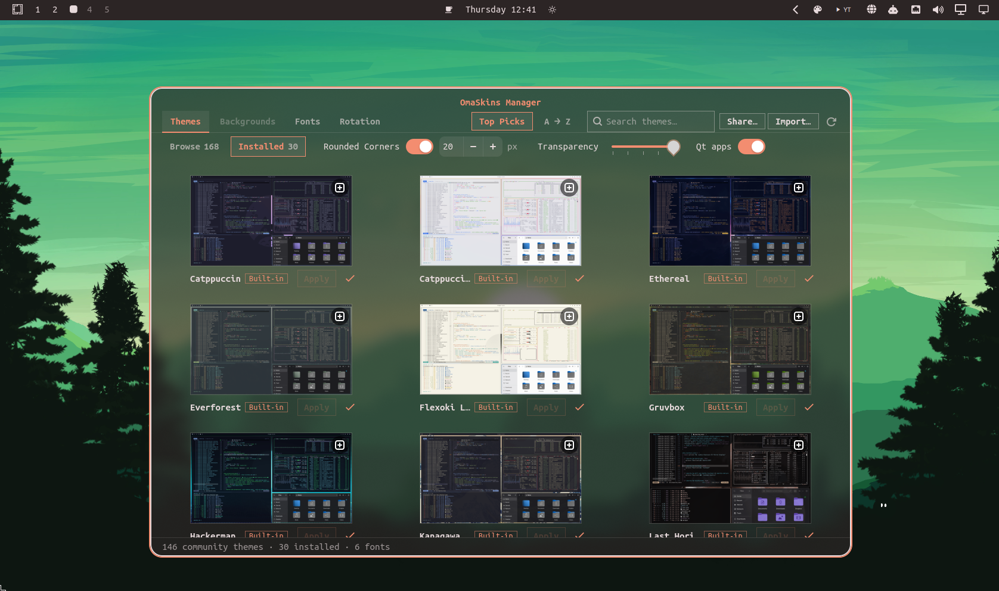

# OmaSkins Manager

An app for [Omarchy](https://omarchy.org) to manage the look of your desktop in one place. Also
called OmaSkins for short.

- **Themes, backgrounds and fonts**: browse every community theme on omarchy.org and every Nerd Font
  package, add and remove them, and switch with one click.
- **Rotation**: change theme and background on a schedule that keeps running with the app closed, with
  day and night theme sets, any theme with any background, and Next and Pause in the bar.
- **Rounded corners**: one radius for windows, menus and popups, whatever the theme.
- **Transparency**: five steps for every see-through window, with blur behind, and Omarchy's menus,
  panels, Nautilus, file dialogs and Qt apps following along.
- **Share**: your whole setup in one file, to move to another machine or to get back later.
- **Clean removal**: removing OmaSkins puts everything back the way Omarchy ships it.

**Requirements:** Python 3 with PyGObject, GTK4 and libadwaita, plus ImageMagick for thumbnails.
All of these ship with a stock Omarchy install. Installing needs no password. Optional: the GitHub
CLI (`gh`, signed in) gives Themes its **Top Picks** order; without it themes sort A → Z.

## Install

    omarchy plugin add https://github.com/JesusLovesYou1013/omaskins.git --enable

Or **Setup › Plugins › Add Plugin** with that URL, then enable it (Omarchy adds plugins switched off).

## Opening OmaSkins

The window opens floating and centred, at 70% of the screen's width and 75% of its height
(Super+T tiles it, as with any window).

Once it's on, any of these:

- **Style › OmaSkins** in Omarchy's menu (the last row of Style: rows a plugin adds always come after
  Omarchy's own);
- the palette icon in the bar › **Open OmaSkins**;
- double-click an exported `.omaskins` file.

Turning OmaSkins off takes the menu row and the file type away again.

## The palette icon

Click it for a small panel under the icon (like Omarchy's other bar widgets); arrow keys and Enter
work, Esc closes it. Five rows:

- **Next background** and **Next theme**: skip ahead now. They follow your rotation's lists when it
  rotates that (no repeats until each has had its turn); without a rotation it's Omarchy's own next
  background, or the next installed theme. Next theme changes the colours and keeps your background.
  What you stop on stays through the next scheduled change, so a Next pressed two minutes before a
  change isn't replaced two minutes later.
- **Pause backgrounds** and **Pause themes**: hold the rotation of one, the other, or both. Each row
  becomes **Resume** while paused, and the panel stays open so you can set both. With one paused the
  other keeps taking its turns. A pause lasts across restarts until you resume.
- **Open OmaSkins**.

The icon is also what keeps OmaSkins on: removing it from the bar (or disabling the plugin) stops the
rotation.

## Tabs

- **Themes**
  - **Browse**: every community theme listed on [omarchy.org/themes](https://omarchy.org/themes/), with
    its screenshot. Ones you already have carry an accent ✓.
  - **Installed**: the built-in themes plus the ones you've added. The current theme comes first.
  - **Top Picks / A → Z** sorts either list: by GitHub stars, or by name.
  - Click a theme for its page: large screenshot, its color palette (read from the theme's
    `colors.toml`, fetched from GitHub for themes you haven't installed), details, and
    **Add / Apply / Remove / Backgrounds / Open on GitHub**. Right-click a card to add or remove it
    without opening the page.
  - A built-in theme can be hidden from OmaSkins only (no password), or removed entirely (password;
    it's part of Omarchy's package). **Restore** under Browse brings either back.
  - **Rounded Corners**, **Transparency** and **Qt apps** sit on this tab's top row (see below).
- **Backgrounds**: your installed themes down the left edge. Pick one to see its backgrounds:
  the ones that ship with the theme, plus your own from `~/.config/omarchy/backgrounds/<theme>/`
  (marked **Yours**). The current background carries the ✓. **Add backgrounds…** copies pictures in,
  **Open folder** shows where they live, and right-click a background to save it to Pictures or copy
  it to the current theme's backgrounds.
- **Fonts**
  - **Browse**: the Nerd Font packages in the Arch repos, which is where Omarchy's own
    Install › Font gets them. The ones Omarchy's menu offers are marked **Omarchy pick**.
    **Top Picks** orders them by how many Arch users have each installed.
  - **Installed**: the monospace fonts Omarchy can use, each name drawn in its own font. The
    current font carries the ✓. Previews are sized so every font's lowercase letters are the
    same height as your current font's, so they compare fairly.
  - Adding or removing a font package asks for your password (fonts are system packages), in
    Omarchy's own installer window, after OmaSkins says why.
- **Rotation**: see below.

**Update all** (top right) saves the rotation settings and re-reads your themes, backgrounds, fonts
and omarchy.org's list.

## Rotation

Changes theme and background on a schedule, and keeps running with the app closed (OmaSkins' engine
runs as an Omarchy service plugin).

- **Themes** and **Backgrounds** switches, with one interval for both, from every 5 minutes to once
  a day. Changes land on the clock: every 20 minutes means at :00, :20 and :40.
- Check the themes to rotate through on the left; pick the backgrounds for each on the right.
- **Dawn & Dusk**: separate day and night theme sets, switching at sunrise and sunset where you are.
- **Mix it up!**: any theme with any background, each change pairing a random theme with a random
  selected background from any theme in the rotation.
- **Saved sets**: name a whole Rotation setup and switch back to it later.

A scheduled change is skipped, and the next one tries again, when:

- the screen is locked, the screensaver runs, or an app is fullscreen (a game or a video);
- you logged in, woke the computer or came back less than five minutes ago;
- you just picked a theme or background yourself, with Omarchy's own switchers or with Next in the
  palette panel: your pick stays through the next change;
- you paused it in the palette panel.

## Rounded Corners, Transparency, Qt apps and file dialogs

All of this runs as you: no password, no packages, nothing of Omarchy's changed. It's set on the
Themes tab's top row and kept up to date by OmaSkins' engine, for every theme you switch to or
rotate through.

- **Rounded Corners**: one radius for windows, menus and popups, whatever the theme. Off means each
  theme's own corners.
- **Transparency**: five steps; step 2 is exactly Omarchy's own. Windows fade live (no Hyprland
  reload). Omarchy's menus, panels and notifications follow. Nautilus and the file dialogs make only
  their background see-through (files, icons and text stay solid), in libadwaita's grey, with the
  sidebar a little more solid. From step 3 up there is blur behind.
- **Qt apps** (on by default): Qt5 apps such as VLC and KeePassXC in the theme's colours,
  see-through like the rest (a video stays solid). OmaSkins builds its small Qt style on your
  machine the first time a Qt5 app is installed, with the compiler Omarchy already ships
  (`base-devel`) and Qt5's own build kit. Apps opened after your next login use it. Apps with a
  style of their own (KeePassXC's dark/light themes) keep it.
- **File dialogs**: Open/Save dialogs (Omarchy's dialog service, GTK3) look like Nautilus. A
  change shows from the next dialog you open. Dark themes use GTK3's dark theme from
  `gnome-themes-extra`, which is part of Omarchy's base install; if it's missing, OmaSkins writes
  the same one-line theme to `~/.local/share/themes/Adwaita-dark/` and removes it again when the
  package is there.

## Share

**Share…** (top right) › **Export all settings…** saves your setup as a `.omaskins` file;
**Import…** or a double-click brings one in. Anything listed on omarchy.org, or available as an Arch package, travels as the same
link the stock installer uses. Everything else (a theme that isn't listed, your own backgrounds, a
font that isn't from a package) is copied into the file, so it works for someone who has never seen
it. On import you tick what to bring in, then choose to just import or to also apply the look the
file was exported with: theme, background and font, corners, transparency, Qt apps, text size, the
rotation that was in use (a saved set with unsaved changes comes back exactly so) and what was
paused. An export with **Also apply** on import is how to get everything back after removing and
re-adding OmaSkins; names that already exist are merged, never copied. Any work that needs your
password (fonts, built-in themes) is done at once, in Omarchy's own installer window, and can be
cancelled.

A setup file is checked before anything is taken from it. A theme in it comes in without the files
that run code (as Omarchy does for downloaded themes) and never with git's own folder: a file that
carries one is refused. When exporting, `git` is only asked about a theme folder whose `.git/config`
holds what a plain clone writes; any other theme is copied into the file instead.

## What it writes

While it's on:

- `~/.config/omaskins/` (your settings), `~/.local/state/omaskins/` (the engine's notes and a copy of
  its remover), `~/.cache/omaskins/` (downloaded screenshots and previews; readable by you only, since previews are
  small copies of your pictures);
- one row in `~/.config/omarchy/extensions/omarchy-menu.jsonc`, a hidden launcher entry and the
  `.omaskins` file type in `~/.local/share/`.

Only once you use Rounded Corners, Transparency or Qt apps:

- `~/.config/hypr/omaskins.lua`, and one line loading it at the end of `~/.config/hypr/looknfeel.lua`;
- an OmaSkins block in `~/.config/gtk-4.0/gtk.css`, `~/.config/gtk-3.0/gtk.css` and
  `~/.config/omarchy/shell.toml` (anything else in those files is left alone);
- the built Qt style in `~/.local/share/omaskins/qt5/`.

Themes you add go where Omarchy keeps them (`~/.config/omarchy/themes/`), and backgrounds you add go
to `~/.config/omarchy/backgrounds/`.

## Remove

    omarchy plugin remove io.github.jesuslovesyou1013.omaskins

Or **Setup › Plugins**, then remove it there. Removing puts everything back the way Omarchy ships it
and leaves nothing of OmaSkins behind:

- Transparency fades back to Omarchy's own, and rounded corners go back to each theme's own;
- OmaSkins' Hyprland file, its line in `looknfeel.lua` and its blocks in the files above are taken
  out, leaving the rest of those files as they were;
- the Qt style, the menu row, the file type and all of OmaSkins' own folders are deleted;
- built-in themes you removed entirely are restored. That asks for your password once, in Omarchy's
  own installer window; cancel it and they stay removed.
- If your background is from a different theme than the current one (OmaSkins can mix them, Omarchy
  itself can't), a menu asks which to keep: the theme, with one of its own backgrounds, or the
  background, with its theme. Close the menu to leave both as they are.

Left alone: your font and text size, and the themes and backgrounds you added. They are Omarchy's as
much as OmaSkins', and Omarchy's own menus manage them.

Your rotation settings are deleted with the rest. **Export all settings…** first if you want them
back later.

Switching OmaSkins off (without removing it) stops the rotation and takes the menu row away;
everything else stays as you set it. If you removed OmaSkins while it was switched off, run its
remover once yourself:

    python3 ~/.local/state/omaskins/uninstall/omaskins-uninstall io.github.jesuslovesyou1013.omaskins --now

## Downloads

OmaSkins downloads omarchy.org's theme list and screenshots, a theme's `colors.toml` and backgrounds
from its GitHub repository, Arch's package statistics for the font order, and a font package's
regular face for its preview. A theme is added with `git clone`, after Omarchy's own
`omarchy-git-url-check`. Every download has a size limit and stops at it: 52 MB for a picture,
111 MB for a font package, 384 MB for a theme. Each is the largest one on offer when measured
(October 2026) plus about 10%.

## Commands it runs

Changes go through Omarchy's own commands: `omarchy-theme-set`, `omarchy-theme-bg-set`,
`omarchy-font-set`, `omarchy-pkg-add` and `omarchy-pkg-drop` (in
`omarchy-launch-floating-terminal-with-presentation`, where the password is typed),
`omarchy-git-url-check`, `omarchy-notification-send` and `omarchy-shell`. Besides those: `git clone`
for a theme, `hyprctl` for the live fade and corners, the same `pkill` signals Omarchy's font command
sends so open terminals re-read a font change, and one `systemctl --user try-restart` of the
file-dialog service so a new dialog look shows. `sudo` appears only in the password steps above:
font packages, and hiding or restoring a built-in theme.

## Tests

    python3 -B -m unittest discover -s tests -v

Headless; they run against a throwaway fake home and never touch your real files.

## License

GPL-3.0
